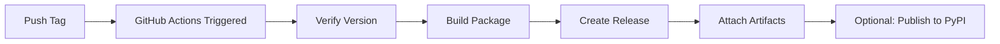

# Add GitHub Tag-Based Versioning with setuptools-scm

## Summary

This PR implements automated version management using `setuptools-scm` and git tags, replacing the hardcoded version in `pyproject.toml`. The package version is now automatically derived from git tags following semantic versioning, with full CI/CD automation for releases.

## 🎯 Key Features

### Automated Versioning
- ✅ Version automatically derived from git tags (e.g., `0.1.0`, `1.2.3`)
- ✅ No `v` prefix in tags for cleaner Python versioning
- ✅ Development versions between tags (e.g., `0.1.0.dev12+g1a2b3c4`)
- ✅ Fallback to `0.1.0.dev0` when no tags exist or package not installed
- ✅ `--version` CLI flag now displays dynamic version

### Release Automation
- ✅ GitHub Actions workflow triggered on tag push
- ✅ Automatic building of wheel and source distributions
- ✅ GitHub Release creation with artifacts
- ✅ Support for pre-releases (`-rc`, `-alpha`, `-beta`)
- ✅ Version validation (ensures tag matches package version)
- ✅ Ready for PyPI publishing (commented out, easy to enable)

### Code Quality
- ✅ Comprehensive test suite (7 new tests) for version management
- ✅ Improved exception handling with specific exceptions
- ✅ All tests passing (514 tests, 0 failures)
- ✅ Black, isort, pylint, mypy compliant
- ✅ CI pipeline aligned to Python 3.11 (matches black target-version)

### Documentation & Tooling
- ✅ Complete release documentation (`RELEASING.md`)
- ✅ Step-by-step release process guide
- ✅ Cross-platform formatting scripts (`format_all.sh` for Linux/macOS)
- ✅ Troubleshooting guide for common issues

## 📋 Changes

### Modified Files

**Core Implementation:**
- `pyproject.toml` - Configured setuptools-scm, made version dynamic
- `src/mcp_config/__init__.py` - Added version import with fallback handling
- `src/mcp_config/cli_utils.py` - Updated `--version` flag to use package version

**CI/CD:**
- `.github/workflows/release.yml` - **NEW** - Automated release workflow
- `.github/workflows/ci.yml` - Updated Python version to 3.11 for consistency

**Tests:**
- `tests/test_config/test_version.py` - **NEW** - Comprehensive version tests

**Documentation:**
- `RELEASING.md` - **NEW** - Complete release process guide

**Tools:**
- `tools/format_all.sh` - **NEW** - Formatting script for Linux/macOS
- `tools/format_all.bat` - Updated to match Linux version

## 🚀 How to Use

### For Developers

**Check current version:**
```bash
mcp-config --version
# or
python -c "from mcp_config import __version__; print(__version__)"
```

**Create a release:**
```bash
# 1. Commit all changes to main
git checkout main
git pull

# 2. Create and push a tag
git tag -a 0.2.0 -m "Release version 0.2.0"
git push origin 0.2.0

# 3. GitHub Actions automatically:
#    - Builds the package
#    - Creates a GitHub Release
#    - Attaches distribution files
```

**For pre-releases:**
```bash
git tag -a 0.2.0-rc1 -m "Release candidate 0.2.0-rc1"
git push origin 0.2.0-rc1
```

### Version Format

Between tags, the version follows this pattern:
```
0.2.0.dev12+g1a2b3c4
  │   │    │   └─ git commit hash
  │   │    └───── 12 commits since last tag
  │   └────────── development version
  └────────────── next version (from last tag)
```

## 🧪 Testing

All tests pass successfully:

```bash
# Run version-specific tests
pytest tests/test_config/test_version.py -v
# Result: 7/7 tests passed

# Run full test suite
pytest tests/
# Result: 514 tests passed, 5 skipped, 0 failures
```

**Code quality checks:**
- ✅ Black formatting: All files compliant
- ✅ isort: All imports properly sorted
- ✅ pylint: No errors found
- ✅ mypy: Type checking passed on new code

## 📖 Documentation

The PR includes comprehensive documentation in `RELEASING.md`:

- Semantic versioning guidelines
- Step-by-step release process
- Tag format requirements (no `v` prefix)
- Pre-release workflow (rc, alpha, beta)
- Troubleshooting guide
- CI/CD integration examples
- Best practices for maintainers

## ⚙️ Configuration

### setuptools-scm Settings

```toml
[tool.setuptools_scm]
version_scheme = "guess-next-dev"
local_scheme = "no-local-version"
tag_regex = "^(?P<prefix>)?(?P<version>[0-9]+\\.[0-9]+\\.[0-9]+)(?P<suffix>.*)?$"
fallback_version = "0.1.0.dev0"
```

### Dependencies Added

```toml
[build-system]
requires = ["setuptools>=61.0", "setuptools-scm>=8.0"]
```

## 🔄 Migration Notes

### Before (Hardcoded Version)
```toml
[project]
name = "mcp-config"
version = "0.1.0"  # Had to manually update
```

### After (Dynamic Version)
```toml
[project]
name = "mcp-config"
dynamic = ["version"]  # Automatically from git tags
```

**No breaking changes for users** - version is still accessible via:
- `mcp-config --version`
- `from mcp_config import __version__`

## 🎨 Release Workflow Diagram



## ✨ Benefits

1. **No manual version updates** - Versions automatically increment from tags
2. **Semantic versioning enforced** - Clear version progression
3. **Automated releases** - Push tag → Release created
4. **Development versions** - Clear distinction between releases and dev work
5. **Easy to maintain** - Well-documented process
6. **CI/CD ready** - Full automation included
7. **PyPI ready** - One uncomment away from publishing

## 🚨 Important Notes

1. **Initial tag required**: To start using this, create the `0.1.0` tag:
   ```bash
   git tag -a 0.1.0 -m "Initial release"
   git push origin 0.1.0
   ```

2. **Tag format**: Use tags without `v` prefix (e.g., `0.1.0`, not `v0.1.0`)

3. **CI Python version**: Changed from 3.13 to 3.11 to match black target-version

4. **PyPI publishing**: Disabled by default (commented out in workflow)

## 📦 Example Release Timeline

```bash
# Current state (no tags)
Version: 0.1.0.dev0

# Create first release
git tag -a 0.1.0 -m "Initial release"
Version: 0.1.0

# Work continues (3 commits later)
Version: 0.1.1.dev3+g7a8b9c0

# Create next release
git tag -a 0.1.1 -m "Bug fix release"
Version: 0.1.1
```

## 🔗 Related Issues

<!-- Add any related issue numbers here -->
- Implements automated versioning and release process
- Addresses need for consistent version management

## ✅ Checklist

- [x] Tests added and passing
- [x] Documentation updated
- [x] CI/CD pipeline configured
- [x] Code quality checks passing
- [x] Release workflow tested
- [x] Migration path documented

## 🙏 Reviewer Notes

Please pay special attention to:
1. The `.github/workflows/release.yml` workflow configuration
2. Exception handling in `src/mcp_config/__init__.py`
3. Version test coverage in `tests/test_config/test_version.py`
4. Release process documentation in `RELEASING.md`

---

**Ready to merge!** This PR is fully tested, documented, and includes complete CI/CD automation for releases. 🚀
